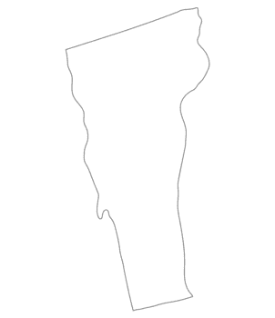

# Reptiles of Vermont 🐍🦎🐢

## Description
A simple guide to the Reptiles of Vermont.

## Project Name
Reptiles of Vermont

---

## Examples of Requirements

### HTML Structure and Semantics

<nav class="navbar">
  
</nav>

<section></section>

Encapsulating Wack-a-Turtle, image, and then fun fact boxes.

---

### CSS Styling and Layout

.flex-container-2 {
  display: flex;
  flex-direction: row;
  gap: 20px;
  justify-content: left;
  flex-wrap: wrap;
}

### Responsive Design

@media (max-width: 900px) {
  .match-wrapper {
    flex-direction: column;
    gap: 40px;
  }
}

### Styling

.mtsbuttonbox {
  display: block;
  width: 495px;
  padding: 10px;
  margin: 20px auto;
  border: 2px solid rgb(10, 82, 10);
  border-radius: 8px;
  text-align: center;
  background-color: #f5fff5;
}

---

## JavaScript Functionality

### Function
function checkAnswer() { ... }

### Arrays
const question = questions[currentQuestionIndex];

### Conditionals
if (answered) return;

if (!selectedOption) { ... }

if (selectedOption === question.name) { ... }

### DOM Manipulation
const feedback = document.getElementById("feedback");
feedback.textContent = "...";
feedback.className = "...";

### Event Listeners
if (submitBtn) submitBtn.addEventListener("click", checkAnswer);
if (nextBtn) nextBtn.addEventListener("click", nextQuestion);

### Loop
for (var i = 1; i <= 9; i++) {
  var square = document.createElement("div");
  square.id = "square-" + i;
  square.classList.add("square");
  square.addEventListener("click", handleClickOnSquare);
  grid.appendChild(square);
  squaresOfDivsAsArray.push(square);
}

---

## Forms and Validation

const form = document.getElementById("surveyForm");

if (form) {
  form.addEventListener("submit", function(e){
    e.preventDefault();

    let reason = document.getElementById("reason").value.trim();
    let knowledge = document.querySelector('input[name="knowledge"]:checked');
    let favorite = document.getElementById("favorite").value;
    let message = document.getElementById("resultMessage");

    if (reason === "" || !knowledge || favorite === "") {
      message.textContent = "Please fill out all fields!";
      message.style.color = "red";
      return;
    }

    let resultData = herpResults[favorite];

    let result = resultData.message + " " + resultData.extra;

    if (knowledge.value === "No") {
      result += " (and just starting your herp journey!)";
    }

    message.textContent = result;
    message.style.color = "green";

    form.reset();
  });
}

---

## Data Handling

### JSON

const herpResults = {
  Snake: {
    message: "🐍 You're a Snake! Mysterious and smart.",
    extra: "You think before you act."
  },
  Lizard: {
    message: "🦎 You're a Lizard! Fast and adaptable.",
    extra: "You adjust quickly to anything."
  },
  Turtle: {
    message: "🐢 You're a Turtle! Calm and steady.",
    extra: "Slow and steady wins your race."
  }
};

---

## Local Storage

var savedScore = localStorage.getItem("lastScore");

localStorage.setItem("lastScore", score);
